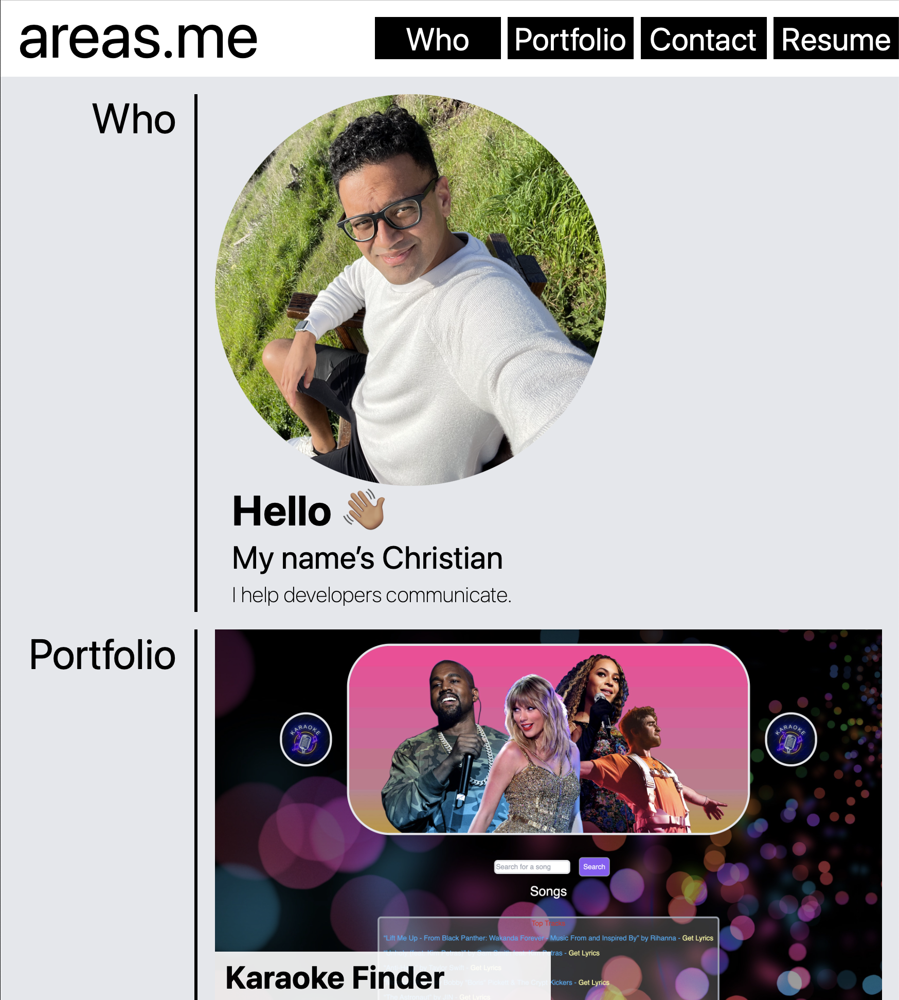

# Challenge 2: Professional Portfolio

The purpose of this project is to build a site that showcases my work to potential employers.

## Installation

This site is built with HTML, CSS, and [Tailwind CSS](https://tailwindcss.com). To install Tailwind CSS, see [Get Started with Tailwind CSS](https://tailwindcss.com/docs/installation).

## Usage

This project is available at [areas-boot-camp.github.io/02-portfolio/](https://areas-boot-camp.github.io/02-portfolio/).

## Credits

Credit goes to [UC Berkeley Extension Coding Bootcamp](https://extension.berkeley.edu/search/publicCourseSearchDetails.do?method=load&courseId=32030644) for their guidance and [Tailwind CSS](https://tailwindcss.com) for their framework.

## License

See [LICENSE](./LICENSE).